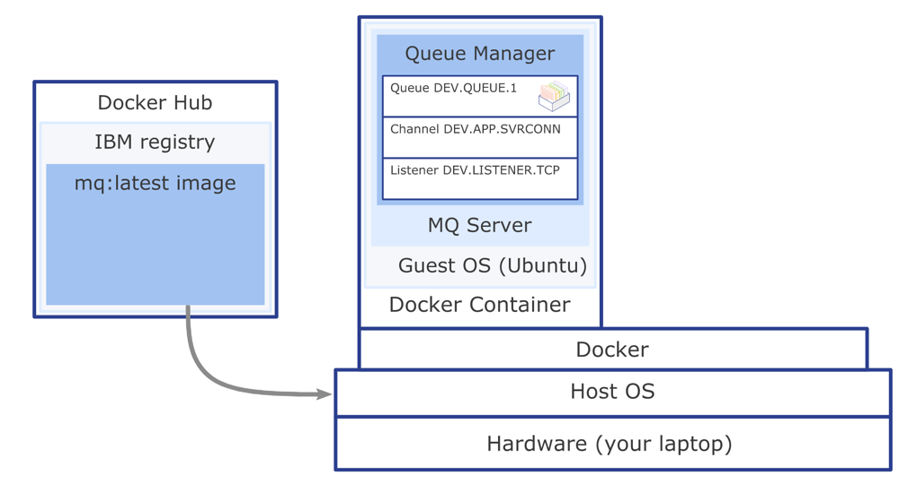

# IBM MQ Developer Essentials
## Create and Configure a Queue Manager
To create and configure queue manager in a container you need the following:
- Either Docker Desktop or Podman (Step 1. Install Docker or Podman)
- The IBM MQ Docker image (Step 2. Get the MQ in Container image)

### Get the MQ in Container image
Containers are run from images and images are built from a specification listed in a Dockerfile. We will use a pre-built IBM MQ server image so that we can just run our container without having to build an image. We will end up with a working MQ installation and a queue manager that is preconfigured with objects ready for developers to work with.

1. Pull the image from the IBM Container Registry that contains the latest version of the MQ server.
 - ```docker pull icr.io/ibm-messaging/mq:latest```

2. When it's done, check which images you have:
 - ```docker images```

### Run the container from the image
Volumes are attached to containers when they are run and persist after the container is deleted. When you run a new container you can attach an existing volume and later reuse your queue manager and queue data.

1. Use Docker or Podman to create a volume.
 - ```docker volume create qm1data```

2. Run the MQ server container.

 - ``` docker run --env LICENSE=accept --env MQ_QMGR_NAME=QM1 --volume qm1data:/mnt/mqm --publish 1414:1414 --publish 9443:9443 --detach --env MQ_APP_USER=app --env MQ_APP_PASSWORD=passw0rd --env MQ_ADMIN_USER=admin --env MQ_ADMIN_PASSWORD=passw0rd --name QM1 icr.io/ibm-messaging/mq:latest```


To show all running containers
 - ```docker ps```

You can use the container name to get command line access inside the container or make a note of your own container ID and use that instead. In the run step, we named our container 'QM1'. For example:
 - ```docker exec -it QM1 bash```

 Once you are in the container, you can check the IBM MQ version. You can display the MQ installation and data paths by running the dspmqver command (display MQ version) in your command line interface:
  - ```dspmqver```

You can display your running queue managers using the dspmq command.
 - ```dspmq```

 To come out of the Docker container and return to your command line, type ```exit``` and press ```Enter```.

 ### What you've done so far
You **downloaded the pre-built Docker image** and **ran the container** to get MQ running on RHEL. The **IBM MQ objects and permissions** that the client applications need to connect to a queue manager and to be able to put and get messages to and from the queue are **created automatically**. Docker and MQ are using your host computer resources and connectivity.

Inside the container, the MQ installation on RHEL has the following objects:
- Queue manager QM1
- Queue DEV.QUEUE.1
- Channel: DEV.APP.SVRCONN
- Listener: SYSTEM.LISTENER.TCP.1 on port 1414

The queue that you will be using, DEV.QUEUE.1, "lives" on the queue manager QM1. The queue manager also has a listener that listens for incoming connections, for example, on port 1414. Client applications can connect to the queue manager and can open, put, and get messages, and close the queue.

Applications use an MQ channel to connect to the queue manager. Access to these three objects is restricted in different ways. For example, user "app", who is a member of the group "mqclient" is permitted to use the channel DEV.APP.SVRCONN to connect to the queue manager QM1 and is authorized to put and get messages to and from the queue DEV.QUEUE.1.

All the MQ objects and permissions that the client application needs are created and configured when you run the MQ server container.



### Summary
In this tutorial, you stood up an MQ queue manager in a container, which came with a preset developer configuration to allow incoming client connections.

When you start developing your own client applications to connect to the queue manager, you'll follow these steps:
1. Configure the connection to the queue manager.
2. Open a queue.
3. Put a message on the queue.
4. Get the message from the queue.
5. Close the connection to the queue manager.

This process demonstrates **point-to-point style of messaging**.

In IBM MQ, the queue manager is effectively the server part of the system, and applications that connect to it are clients.

Usually it is the administrators that look after the MQ server where all the MQ objects are defined and the routing of messages happens. Client applications are created by developers and IBM MQ provides client libraries that developers must include in their applications. These libraries, also called MQ clients, address and use the MQ objects that admins have set up on the MQ server side. In more complex scenarios, the MQ libraries do most of the heavy messaging work for you, so you just have to learn how to use them.

**Configuration is needed on both the server and the client sides for the messaging to work.**

When you first start developing MQ client applications, you need to have access to your own queue manager and a queue, for testing your client application against. The preconfigured MQ in Docker image and the container that you can easily run from it gives you access to a queue manager and many options for configuring MQ objects as you begin developing your own MQ applications.